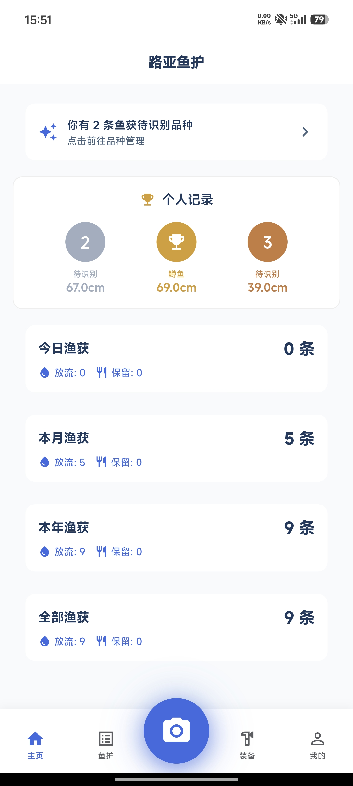
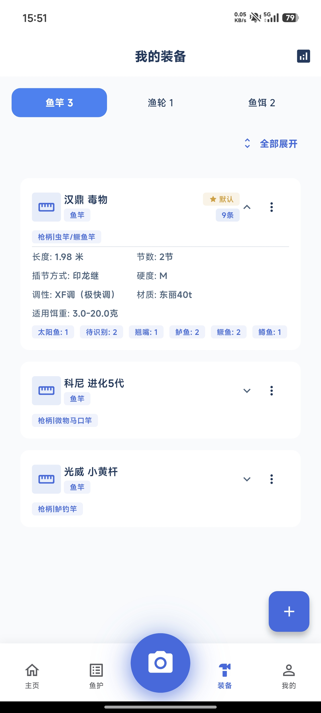
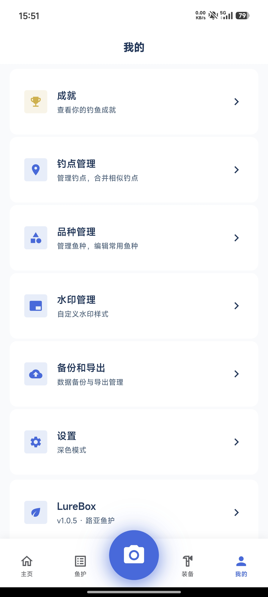
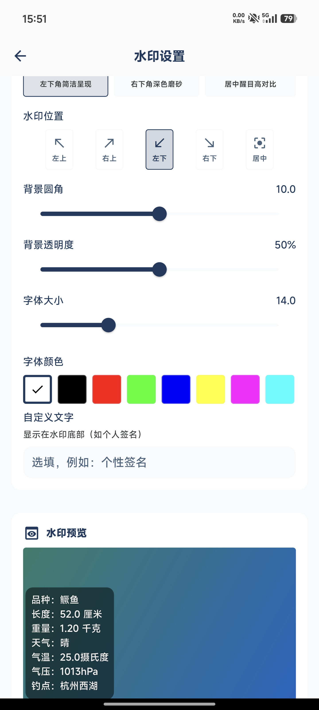

# 路亚鱼护 (LureBox)

一款专为路亚钓鱼爱好者设计的鱼获记录工具，帮助钓友记录每次出钓的渔获。

**版本**: 1.0.5+5 | **Flutter**: 3.41.6+ | **Dart**: ^3.5.4

## 项目背景

我是一名纯纯的路亚爱好者，从未系统接触过编程，顶多算个爱好广泛、喜欢折腾的玩家。这个项目，最初就源于我自己玩路亚时的真实需求。

这个想法在心里盘桓了好几年。期间和很多钓友聊起过，大家都觉得这事有价值、有前景。不止一次感慨：要是再年轻几岁，一定辞职拉个小团队，把这些想法全落地。可拖家带口的普通人，本身也不是专业对口，又被生活的担子压着，求稳才是常态，这些念头，终究只能停在钓友群里吹吹牛。直到 Vibe Coding 的风潮吹到我这里，不用占用太多时间，搭起基础框架后，几乎全靠 Claude 和大模型的助力，把这个藏了好几年的想法，真正变成了能跑起来的项目。

完整构想涉及以下核心能力：

- 📷 **渔获智能识别** - 拍照自动识别鱼种、测量体长、预估体重
- 🏞️ **专属渔获水印** - 一键生成带全维度作钓信息的渔获水印
- 🏆 **趣味成长体系** - 搭配鱼种习性、作钓技巧的成就系统与全鱼种图鉴
- 📋 **精细化管理** - 鱼种、钓点、作钓装备的全维度登记与系统化管理
- 🌤️ **全维度环境记录** - 同步留存天气、风力、气温、水温等关键作钓环境数据
- 📊 **数据化复盘能力** - 基于持续积累的作钓数据，生成可视化图表与 AI 深度分析
- ☁️ **可拓展上层玩法** - 上云后，可拓展社交模块、趣味排行榜，拥有完整的商业化落地空间
- 🎣 **可拓展平行玩法** - 可引导增加台钓版、海钓版适配特定人群，扩展受众群体
- 🌱 **始终不变的内核** - 倡导绿色路亚、坚守放流文化，守护水域生态

越往下深挖越明白，很多看似可行的想法，背后是一个人根本无法跨越的技术与资源门槛。目前落地的版本，和最初的完整构想还有不小差距，还只是个半成品。

技术选型上用了 Flutter，最初其实还抱着一丝幻想：万一哪天上架 App Store，说不定还能有份意外收入。但现实是，至今也没编译过一个 iOS 版本，所有测试都在安卓上跑通，在 iOS 设备上的表现如何，自己也无从知晓。

把它开源出来，就是希望能遇到同频的钓友、同好的开发者，一起打造真正属于路亚人的专属工具。

## 功能预览






## 功能特点

- 📷 **拍照记录** - 快速拍摄鱼获照片，支持 AI 鱼种识别
- 📏 **尺寸记录** - 输入长度，自动估算重量
- 📍 **定位记录** - 自动记录钓获地点，支持位置管理
- 🏷️ **装备管理** - 管理鱼竿、鱼轮、鱼饵，支持设置默认装备
- 🔍 **筛选排序** - 按时间/尺寸/重量/地点筛选和排序
- 📊 **统计分析** - 今日/本月/本年/全部渔获统计，图表可视化
- 🏆 **成就系统** - 记录钓友里程碑
- 🔄 **批量操作** - 支持多选删除
- 📤 **分享** - 一键分享渔获到社交平台
- 💾 **备份导出** - 支持 CSV/JSON 导出，WebDAV 备份
- 🌐 **多语言** - 中英文双语支持，i18n mixin 国际化架构
- 🎓 **新手引导** - 首次使用 Onboarding 引导页
- 👤 **个人中心** - Me 页面，管理个人信息和设置

## 技术栈

| 类别 | 技术 |
|------|------|
| 框架 | Flutter 3.41.6 |
| 状态管理 | Riverpod |
| 路由 | GoRouter |
| 数据库 | SQLite (sqflite) |
| 定位 | geolocator + geocoding |
| 图表 | fl_chart |
| AI 识别 | 多 Provider 支持 (OpenAI/Claude/Gemini/MiniMax/百度/腾讯/阿里云等) |
| 相机 | camera + image_picker |
| 天气 | open_meteo |
| 分享 | share_plus |
| 导出 | csv + json |
| 备份 | archive + crypto |

## 项目结构

```
lib/
├── core/                    # 核心共享层
│   ├── models/              # 数据模型 (16个)
│   ├── providers/           # Riverpod providers (21个)
│   ├── services/            # 业务服务 (含13个AI adapter)
│   ├── repositories/        # 数据访问层
│   ├── database/            # SQLite 数据库
│   ├── router/              # GoRouter 配置
│   ├── di/                  # 依赖注入
│   ├── constants/           # 常量 (字符串/成就/价格区间)
│   ├── design/              # 主题/颜色
│   ├── utils/               # 工具类
│   └── exceptions/          # 自定义异常
├── features/                # 功能模块 (14个feature)
│   ├── home/                # 首页
│   ├── fish_list/           # 鱼获列表
│   ├── fish_detail/         # 鱼获详情
│   ├── camera/              # 拍照
│   ├── catch/               # 渔获记录
│   ├── equipment/           # 装备管理
│   ├── stats/               # 统计
│   ├── achievement/         # 成就
│   ├── settings/            # 设置
│   ├── onboarding/          # 新手引导
│   ├── me/                  # 个人中心
│   ├── location/            # 位置管理
│   ├── share/               # 分享功能
│   └── common/              # 通用功能
├── widgets/                 # 通用组件 (含settings/子目录)
└── main.dart                # 入口
```

## 运行与构建

```bash
# 安装依赖
flutter pub get

# 运行调试
flutter run

# 构建 Android
flutter build apk

# 构建 iOS (需要 macOS + Xcode)
flutter build ios

# 代码检查
flutter analyze

# 格式化
dart format .
```

## 测试

```bash
# 运行所有测试
flutter test

# 运行单个文件
flutter test test/fish_catch_model_test.dart

# 按名称运行
flutter test --name "fish catch"

# 生成覆盖率
flutter test --coverage
```

## 数据模型

- **鱼获记录**: 品种、尺寸、重量、去向（放流/保留）、时间、地点、装备、照片
- **装备管理**: 鱼竿、鱼轮、鱼饵（品牌、型号、长度、调性等参数）
- **品种历史**: 自动记录常用品种，支持别名
- **位置管理**: 钓点名称、坐标、钓获统计
- **i18n 字符串**: 中英文双语，通过 `AppStrings` mixin 在 Riverpod 中提供
- **路由参数验证**: GoRouter 路由参数白名单校验（如装备类型、鱼获 ID）

## 架构特点

- **状态管理**: Riverpod StateNotifierProvider 模式
- **数据层**: Repository 抽象模式（接口 + 实现分离）
- **AI 识别**: 可插拔 Provider 架构，13 种 AI 服务商支持
- **日志**: AppLogger 集中日志，Release 模式自动抑制
- **主题**: Tesla -inspired 设计系统，Electric Blue (#3E6AE1) + Carbon Dark (#171A20)，详细规范见 `DESIGN.md`

## 许可证

[GPL-3.0 License](LICENSE)
